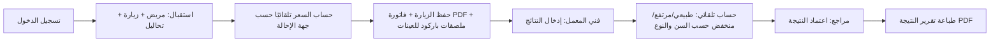

# نظرة عامة — لماذا Python؟

## الخلفية

النسخة الأساسية من LapLIS مبنية بـ **C# / .NET 8 + Avalonia UI**، وهي تقنية حديثة واحترافية، لكنها **لا تعمل إطلاقًا على Windows 7** — هذا قيد فرضته مايكروسوفت نفسها منذ توقف دعم .NET Framework القديم في كل إصدارات .NET من الإصدار 5 فصاعدًا (نهاية 2020)، وليس قرارًا من هذا المشروع.

تمت تجربة مسار بديل بالبقاء على C# لكن بالتراجع لـ **.NET Framework 4.8** (آخر إصدار يدعم Windows 7)، وتبيّن فعليًا أثناء التنفيذ أن مكتبة الواجهة المتوافقة (Avalonia 0.10.x، آخر إصدار يدعم .NET Framework) **لا تدعم خاصية FlowDirection إطلاقًا** — أي لا يوجد فيها أي دعم لعرض الواجهة من اليمين لليسار (RTL) المطلوب للعربية. هذا اكتُشف بالفحص الفعلي لملفات المكتبة، وليس افتراضًا نظريًا.

## لماذا Python + PySide2 هو الحل الأنسب؟

1. **Python 3.9** هي آخر نسخة رسمية من بايثون توفرها مؤسسة Python نفسها بمثبِّت خاص لـ Windows 7 — دعم حقيقي، ليس التفافًا على القيد.
2. **PySide2** (وهي حزمة Qt5 الرسمية للغة بايثون، من شركة Qt نفسها) توفر **دعمًا كاملًا وأصيلًا لـ RTL** عبر `app.setLayoutDirection(Qt.RightToLeft)` — تم اختبار هذا فعليًا وثبت أن كل الشاشات (القائمة الجانبية، محاذاة الحقول، ترتيب الأعمدة) تنعكس تلقائيًا وبشكل صحيح 100%، بعكس مشكلة Avalonia المذكورة أعلاه.
3. **رخصة PySide2 هي LGPL** (بعكس PyQt5 التي تتطلب ترخيصًا تجاريًا مدفوعًا للاستخدام في برنامج مغلق المصدر يُباع تجاريًا) — مناسبة تمامًا لتطبيق معملي خاص كهذا.
4. **SQLite مدمجة في بايثون نفسها** (وحدة `sqlite3` قياسية) — لا حاجة لأي حزمة ORM ضخمة، وهذا يقلل الاعتمادية على حزم خارجية قد تتوقف عن دعم بايثون القديمة مستقبلًا.

> ⚠️ **تحذير مهم: لا تُرقِّ إلى PySide6**. PySide6 هي حزمة Qt6 (وليست Qt5)، و**Qt6 لا يدعم Windows 7 إطلاقًا** (الحد الأدنى Windows 10). لو أي تحديث مستقبلي للمشروع أو لأي حزمة تابعة اقترح "الترقية لـ PySide6"، ده هيكسر التوافق مع Windows 7 بالكامل بصمت دون أي رسالة خطأ واضحة أثناء التطوير على Windows 10/11 — المشكلة تظهر فقط عند التشغيل الفعلي على جهاز Windows 7. تأكد دائمًا أن `requirements.txt` يحتوي على `PySide2` (وليس `PySide6`) قبل أي بناء نهائي (`.exe`) موجَّه لأجهزة Windows 7.

## ما الفرق عن النسخة الرئيسية (.NET)؟

| الناحية | النسخة الرئيسية (.NET) | نسخة Python (هذه) |
|---|---|---|
| نظام التشغيل | Windows 10/11 فقط | Windows 7 SP1 فأحدث |
| الواجهة | Avalonia UI (حديثة، Fluent Design) | PySide2/Qt5 (كلاسيكية، احترافية) |
| قاعدة البيانات | SQLite عبر Entity Framework Core | SQLite مباشرة (sqlite3 القياسية) |
| نطاق الميزات | كامل (تقارير، سجل تدقيق، صلاحيات تفصيلية، ميكروبيولوجيا) | أساسي + سجل تدقيق + إدارة كاملة للكتالوج (نفس منطق نظام الأكسس الأصلي وأكثر) |
| توليد PDF | QuestPDF | ReportLab + خط DejaVu Sans المُضمَّن |

## تصميم الواجهة: إرشاد بدل ترك المستخدم تائهًا

كل شاشة تبدأ بشريط إرشادي قصير (خلفية زرقاء فاتحة، أيقونة ℹ) يشرح بجملة واحدة الغرض من الشاشة
وكيفية استخدامها، وكل حقل أو زر غير واضح فورًا له تلميح (tooltip) يظهر عند تمرير الفأرة عليه.
شاشة الاستقبال - الأكثر تعقيدًا - مقسَّمة لثلاث خطوات مرقَّمة بوضوح (بيانات المريض ← التحاليل ←
الدفع والحفظ) بدل نموذج واحد طويل. النافذة تفتح ملء الشاشة تلقائيًا حتى لا تحتاج أي شاشة (مثل
كتالوج التحاليل) لشريط تمرير أفقي مزعج.

## مبدأ اختيار البيانات المرجعية

تستخدم هذه النسخة **بالضبط نفس بيانات الأكسس الحقيقية المُستخرَجة** المستخدمة في النسخة الرئيسية (954 تحليل، 2289 سعر، المدى الطبيعي، الأقسام، جهات الإحالة، وتفاصيل المعايير المتعددة الحقيقية لتحاليل مثل CBC ووظائف الكبد/الكلى...) — لم يُعَد استخراجها من جديد، بل أُعيد استخدامها مباشرة من ملفات JSON التي بُنيت في المرحلة الأولى من تحليل `ahmed_lab.mdb`.

## دورة العمل الأساسية

راجع [04-USER-GUIDE.md](04-USER-GUIDE.md) لشرح كل شاشة بالتفصيل، و[03-BUILD-EXE.md](03-BUILD-EXE.md) لطريقتين لبناء ملف `.exe` (على جهاز Windows مباشرة، أو عبر `Dockerfile` جاهز من Linux/Mac بدون جهاز Windows فعليًا).
