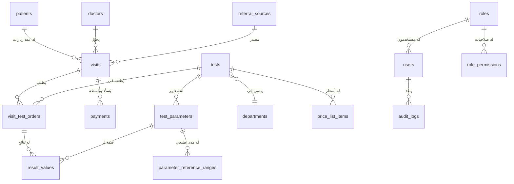

# قاعدة البيانات (SQLite)

## مكان الملف

```
Windows: C:\Users\<اسم المستخدم>\AppData\Roaming\LapLIS-Python\laplis.db
Linux/Mac: ~/.config/LapLIS-Python/laplis.db
```

## الجداول الرئيسية



### tests + test_parameters
نفس مبدأ النسخة الرئيسية: بدلاً من جدول منفصل لكل تخصص معملي، كل تحليل له قائمة معايير خاصة به في `test_parameters`. تحليل بسيط مثل "Bleeding Time" له معيار واحد فقط ("النتيجة")، بينما تحليل مثل "CBC" له 22 معيارًا حقيقيًا (WBC، RBC، HB...) — مأخوذة من نفس البيانات الحقيقية المُستخرَجة من ملف الأكسس الأصلي (`ahmed_lab.mdb`) المستخدمة في النسخة الرئيسية.

### parameter_reference_ranges
لكل معيار، مدى طبيعي يختلف حسب `sex` (Male/Female/Both) والفئة العمرية (`age_from_years` → `age_to_years`)، مع `low_value`/`high_value` للقيم الرقمية أو `normal_text` للقيم الوصفية.

### visit_test_orders + result_values
سطر واحد لكل تحليل مطلوب ضمن الزيارة (`visit_test_orders`)، والقيمة الفعلية لكل معيار (`result_values`) مع `flag` محسوب تلقائيًا (`Normal`/`High`/`Low`/`Abnormal`).

عمود `status` في `visit_test_orders` يمرّ بأربع مراحل (بدون أي تعديل على بنية الجدول، فهو عمود نصي حر):
`Ordered` (طُلب التحليل، لم تُدخَل نتيجته بعد) → `InProgress` (مسودة) → `Completed` (أُدخلت كل
القيم، بانتظار المراجعة) → `Reviewed` (اعتمدها المراجع — هذه هي المرحلة الوحيدة التي يُسمح فيها
بإنشاء ملف PDF للنتيجة). كل انتقال بين المراحل يُسجَّل في `audit_logs` (`review_approve`/`review_reject`) بدلًا من إضافة أعمدة `reviewed_by`/`reviewed_at` منفصلة.

### roles + role_permissions
كل دور له صلاحيات منفصلة لكل وحدة (`Dashboard`, `Reception`, `Visits`, `Results`, `PatientHistory`, `Catalog`, `Pricing`, `Settings`, `Users`, `Audit`, `Backup`)، وكل صلاحية لها 4 مستويات (عرض/إضافة/تعديل/حذف). عند إضافة وحدة جديدة (مثل `Settings`) لقاعدة بيانات قائمة بالفعل، تعمل دالة `_backfill_missing_module_permissions()` في `app/seed.py` تلقائيًا عند بدء التشغيل لإضافة صلاحيات افتراضية للوحدة الجديدة لكل الأدوار الموجودة (بدل أن تختفي الشاشة الجديدة بصمت).

### audit_logs
سجل تدقيق لكل عملية إضافة/تعديل/حذف/دفع في النظام: `table_name` (اسم الجدول المتأثر)، `row_id` (معرّف السطر)، `action` (نوع العملية)، `user_id` (من نفّذ العملية، قد تكون فارغة لعمليات النظام)، `timestamp`، `details` (تفاصيل نصية اختيارية). تُكتب هذه السجلات من داخل نفس العملية (Transaction) الخاصة بالحفظ الأساسي (بتمرير معامل `conn` لدالة `log_action`) لتفادي مشكلة قفل SQLite (`database is locked`) التي تحدث لو فُتح اتصال منفصل للتسجيل أثناء وجود اتصال آخر مفتوح بالفعل بعملية كتابة على نفس الملف.

## إعادة تعبئة البيانات المرجعية

منطق التعبئة موجود في `app/seed.py` — يعمل مرة واحدة فقط عند أول تشغيل (عندما تكون الجداول فارغة)، ويقرأ البيانات من ملفات JSON في `app/seed_data/` (نفس الملفات المُستخدَمة في النسخة الرئيسية، منقولة مباشرة دون إعادة استخراج).
